<!-- @import "[TOC]" {cmd="toc" depthFrom=1 depthTo=6 orderedList=false} -->

<!-- code_chunk_output -->

- [旧版Fart12定制版jadx的弊端](#旧版fart12定制版jadx的弊端)
- [新工具：Fart12定制自动批量修复脚本发布](#新工具fart12定制自动批量修复脚本发布)
  - [Fart12无惧环境检测的原因](#fart12无惧环境检测的原因)
  - [一行命令自动修复所有的dex](#一行命令自动修复所有的dex)
- [案例演示完整脱壳修复流程](#案例演示完整脱壳修复流程)
  - [先脱整体壳](#先脱整体壳)
  - [再脱抽取壳](#再脱抽取壳)
  - [重组dex](#重组dex)
  - [重组dex之在手机上使用FartFix](#重组dex之在手机上使用fartfix)
- [壳的检测机制的绕过](#壳的检测机制的绕过)

<!-- /code_chunk_output -->


### 旧版Fart12定制版jadx的弊端

之前推出的Fart12定制版jadx可以将Fart12脱下来的dex文件与主动调用过程中拿到的函数体bin文件自动重构与合并，修复并合并成新的dex。

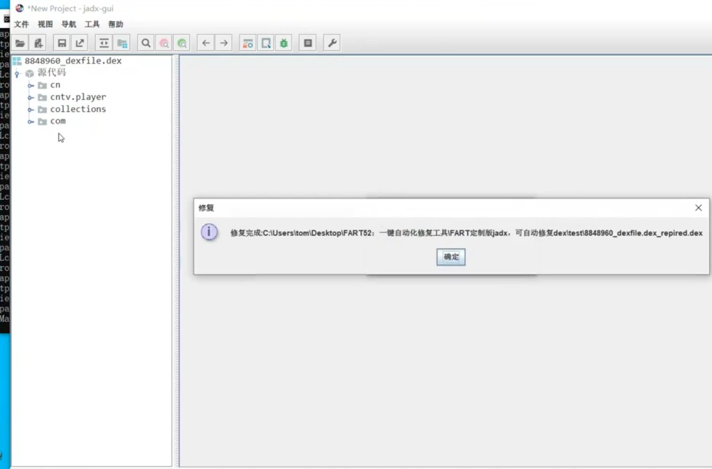

修复完之后dex文件大小也会变大，且函数体也由原来的nop变成了真正的函数逻辑代码体。

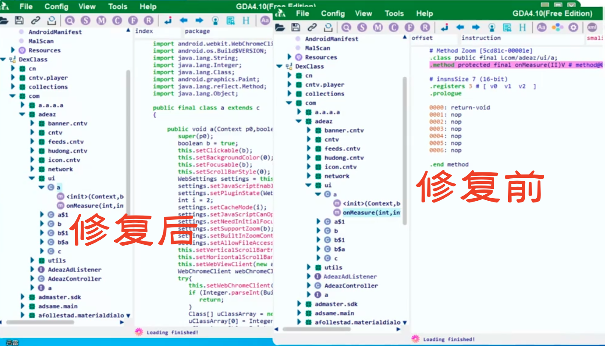

工具虽然好用，但是还有些局限。比如：

1. 一次只能修复单个dex文件，效率不高；
2. 还有就是修复时机的问题，使用不同脱壳点dump下来的dex来修复，有些会出现修复失败的情况。

针对上述的第二点，展开说明一下。理论上来讲，在二代函数体填充壳的脱壳过程中，其实不管哪个时机点dump下来的整体dex，应该内容是一模一样的，或者说在滞后一些的时机dump下来的dex，应该还比稍早时期dump的还要完整一些，因为在App的运行过程中会触发一些函数体的解密和还原。

但是有些时候，使用滞后点dump下来的整体dex来修复的时候，竟然会出现修复失败的情况，那是因为有些壳在整体加载完成后，对内存中的dex结构，进行了一些破坏，以对抗一些整体dump的工具。比如破坏dex的文件头，就可以导致哪怕脱下来之后jadx、geb等逆向工具也识别不出这个dex，也可以对抗如frida-dexdump的工具，对内存中dex文件头的遍历搜索。相关代码如下：

```ts
/* https://github.com/hluwa/frida-dexdump/blob/d4b7d24a8ce0dada17fb1ce9849a8c1cffcb2cae/agent/src/search.ts#L115 */

Process.enumerateRanges('r--').forEach(function (range: RangeDetails) {
        try {
            Memory.scanSync(range.base, range.size, "64 65 78 0a 30 ?? ?? 00").forEach(function (match) {
                if (range.file && range.file.path
                    && (range.file.path.startsWith("/data/dalvik-cache/") ||
                        range.file.path.startsWith("/system/"))) {
                    return;
                }
                ...
            });

```

内存中的dex结构只要是可以不影响App的正常运行，还有很多字段可以随机填充一些无用的垃圾数据，来构造畸形的dex，使得脱下来的dex无法别识别、反编译，这种情况会影响到使用滞后点dump下来的dex进行修复时的成功率。


### 新工具：Fart12定制自动批量修复脚本发布

介绍新工具之前先打个广告。

#### Fart12无惧环境检测的原因

Fart12的脱壳ROM没有root，也不是userdebug调试系统，也没有fart等任何字符串特征指纹，也有谷歌应用商店，他就是一个正常的普通人的手机系统。

#### 一行命令自动修复所有的dex

该自动化修复工具专为Fart12脱壳ROM定制，针对赠送的FART10以及FART12脱壳获取的所有dex以及bin文件，可自动化一键修复合并所有dex和bin文件，不再需要一个个进行修复。具体使用流程如下： 

1. 在使用whitelist.txt文件，完成要修复的类的主动调用后，直接`adb pull /sdcard/ooxx/packagename`，获取完整目录文件，该目录下有FART10以及FART12脱壳以及修复得到的所有dex、txt、bin文件，目录内容大致如下：

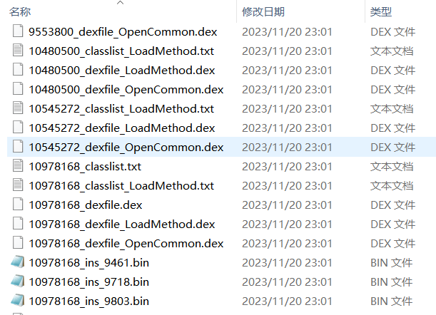

2. 启动cmd，执行java -jar repireall folderpath即可开始对该目录下的所有dex和bin文件的合并修复，下图为开始修复截图，此时开始逐个对dex使用bin文件进行自动化修复。

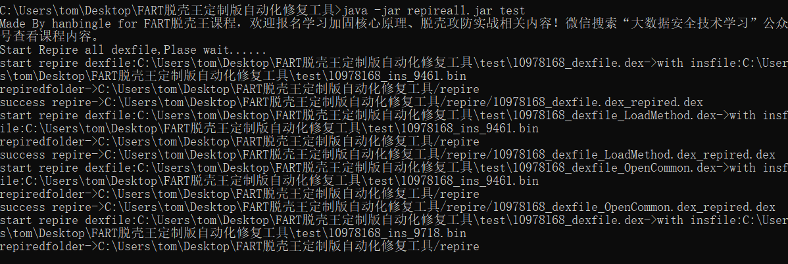

3. 当修复完成后，此时会打印Rrepire all dexfile end!提示，此时代表自动化修复已经结束。

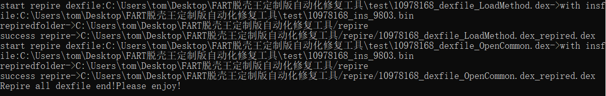

修复后的dex位于当前目录下的repire目录，下图为该目录，以及修复的dex文件截图。

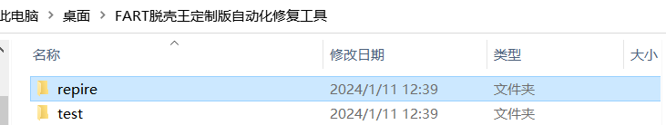
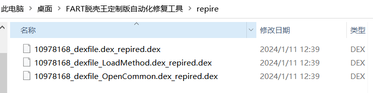

修复完成后，只需要使用jadx、jeb、gda等打开即可。

### 案例演示完整脱壳修复流程

首先将test.apk安装到Fart12手机中去。

```
$ adb install test.apk
```

#### 先脱整体壳

安装完成后，长按App的图标，点击“应用信息”，在“权限”一栏，把“文件和媒体”的权限改成“允许管理所有文件”，任何提示都点击“允许”。最终在“已允许”栏目中出现“文件和媒体”。

>当然，有些App其实没有申请文件和媒体的权限，脱壳ROM针对这一点已经做了处理。在App安装的时候，会为其申请这个权限，所以不用担心这一点。

这时候再点击打开App，这样整体壳已经脱壳完成。adb进入手机中，可以看到已经在不同时机脱下来的整体dex文件，和类列表txt文件。

```
$ cd /sdcard/ooxx/com.yunmai.valueoflife
$ ls
```

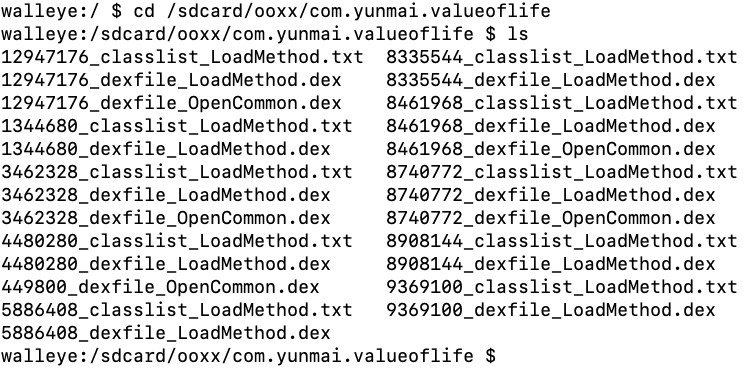

可以在文件夹中直接搜一些AndroidManifest.xml中注册好的四大组件函数名，这些函数名一般是无法被混淆的。例如`com.yunmai.valueoflife.MainActivity`。

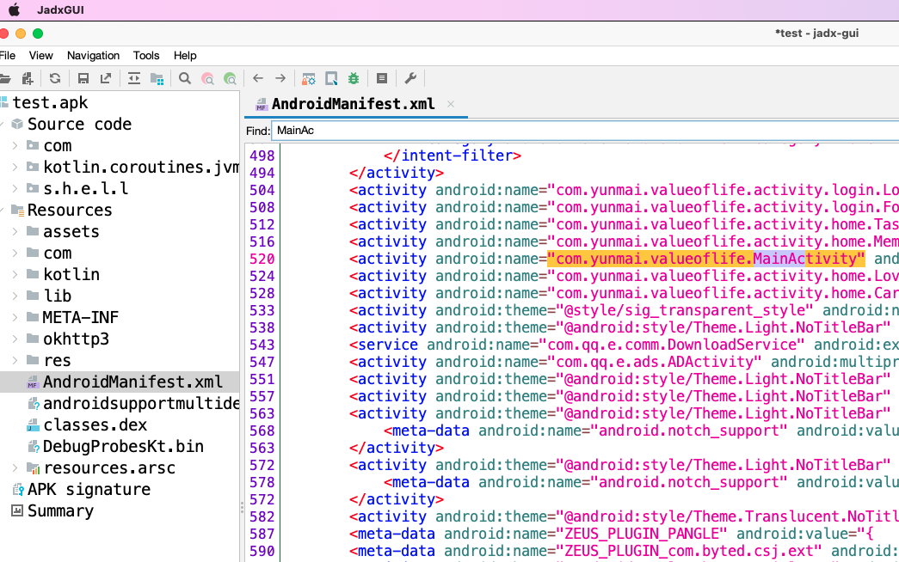

使用的命令如下：

```
$ grep -ril "MainActivity" *
```

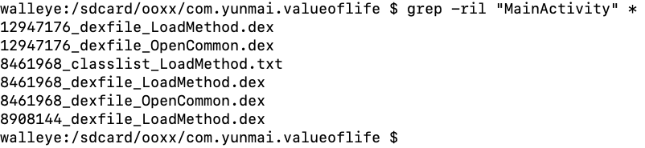

那么在`8461968_classlist_LoadMethod.txt`文件中存在着我们要找的类，那就把`8461968_dexfile*.dex`拖到电脑上，随便打开一个反编译看下。发现确实大部分类名、方法名都进行了混淆。

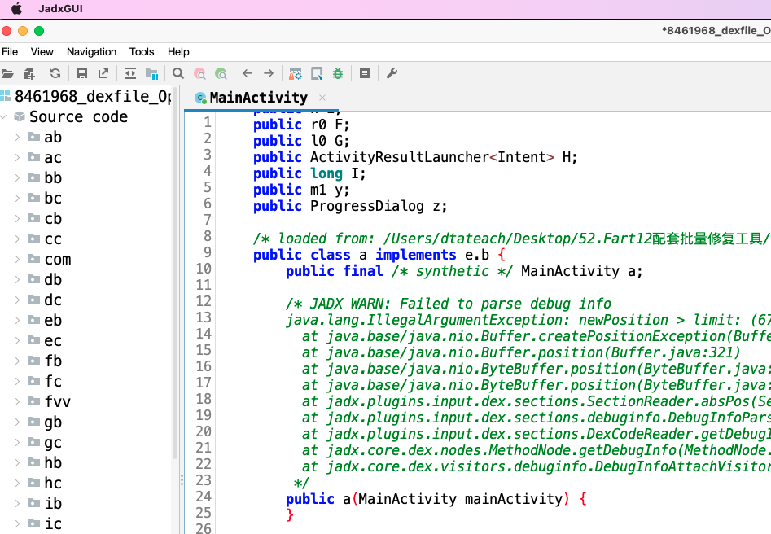

切换到smali的tab，可以看到方法体也都是nop，这是典型的抽取壳特征，看不到方法的实际逻辑过程。

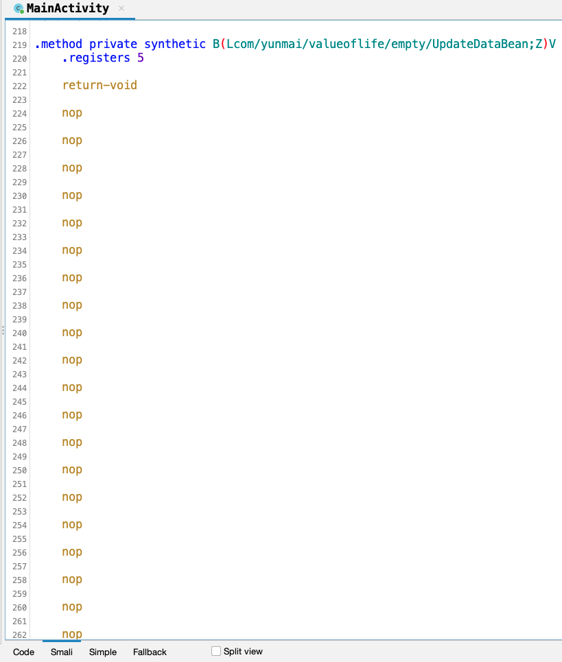

那下一步就是解决抽取壳的问题，把函数体恢复出来。

#### 再脱抽取壳

脱抽取壳，采用的是将类加载起来，再dump函数体到bin文件的方式。最后将bin文件里的函数体回填到dex中，组成完整的dex文件，这样上图中的方法逻辑就恢复好了。

并且在脱壳的方案上，选择的是白名单`Whitelist`的模式。为什么不直接全量脱？这是有讲究的，原因有三：

1. 有些App比较大，几万几十几万百万个类方法，全量恢复耗时耗力，系统承载不住会将应用kill掉或者自己崩溃。

2. 有些壳会写一些`App`用不上的垃圾类，在垃圾类里写一些退出的代码，这些垃圾类在App的正常使用流程中永远不会被加载，此时如果Fart12将其加载了，就踩上了地雷，App崩溃退出。

3. 有些壳还会对Art的类加载流程中的函数进行hook来感知到哪些类正在被加载，如LoadMethod或LinkCode，一旦发现对类列表的遍历行为即可退出，防止后续主动加载类方法行为的发生。

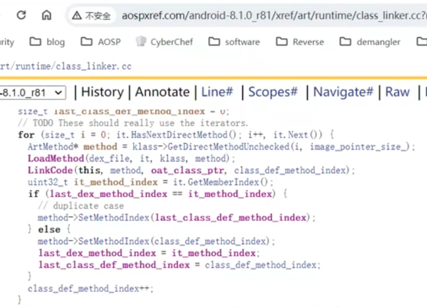

我们这个案例不存在上述情况，所以先学习一下全量恢复的方法。在`/sdcard/ooxx/com.yunmai.valueoflife`目录下，执行：

```
$ cat *classlist* >> whitelist.txt
```

不放心可以看下`whitelist.txt`中是否已经填满了函数类方法名。

打开`logcat`，稍微等一会儿，就可以看到日志中出现`fart`的日志。这时候就是在`dump`类的函数体文件。

```
ActivityThread: sleep over and start fart
ActivityThread: try loadClass class:XI.CA.XI.K0$XI
ActivityThread: try loadClass class:XI.CA.XI.XI
```

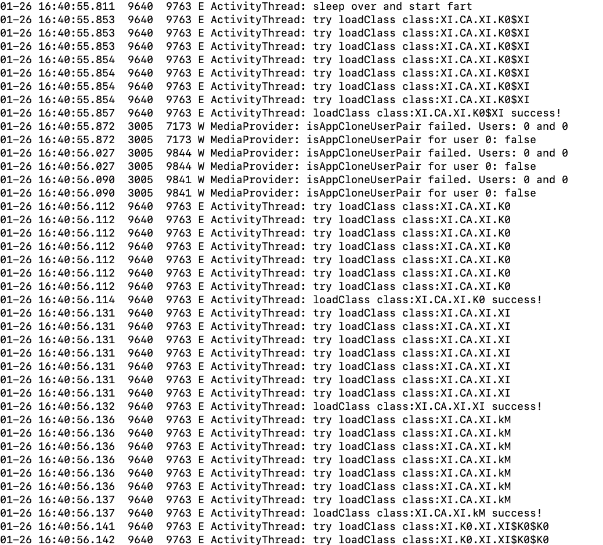

可以多次用`ls -alit`命令查看最新生成的bin文件。

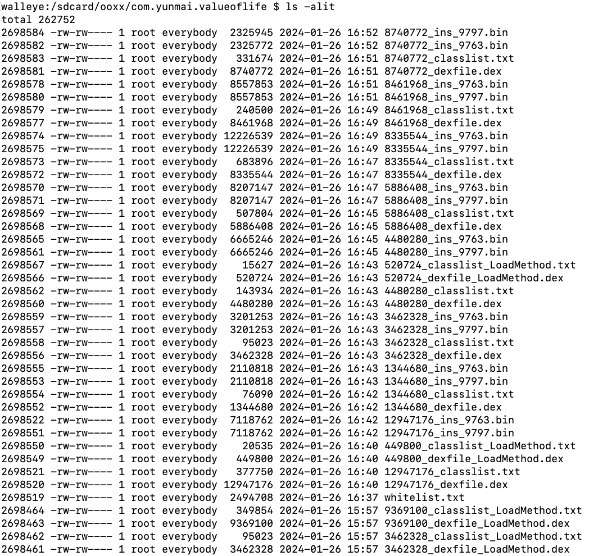

dump过程可以持续数分钟至数小时，直至`logcat`中出现`fart run over`字样即dump结束，然后将文件夹整体拖到电脑上。

```
% adb pull /sdcard/ooxx/com.yunmai.valueoflife
```

#### 重组dex

由于新工具的发布，重组dex变得异常简单，一句命令即可：

```
% java -jar repireall.jar com.yunmai.valueoflife
```

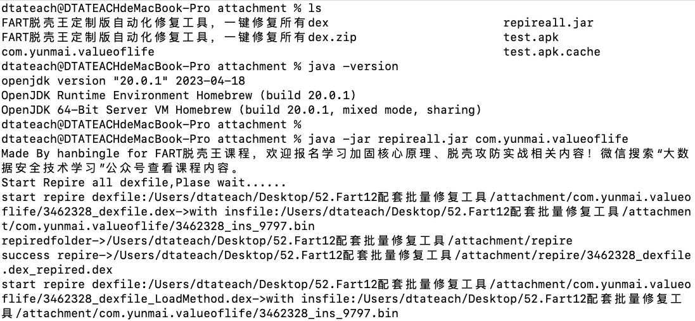

>当然电脑上要提前安装好JDK环境这肯定是必须的。

重组需要一定的时间，工具会自动使用bin文件中的函数体来填入对应的dex文件，重组完成的提示是：`Repire all dexfile end!Please enjoy!`

重组完成会同目录下生成`repire`文件夹，内含所有修复好的dex文件。比如我们再看之前缺少函数体的那个dex试试看，就是这样的效果，函数体的业务逻辑已经一览无余。

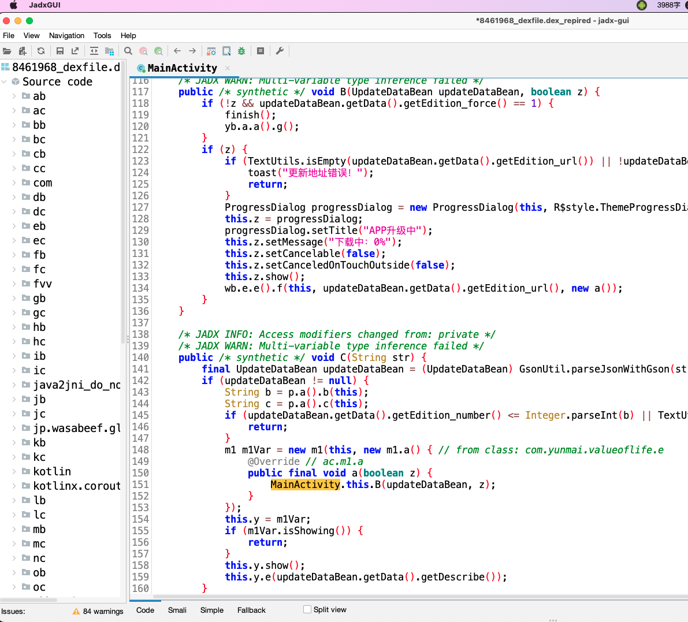

另外，大家也会有疑问，dex、LoadMethod、OpenCommen三个文件有什么区别呢？

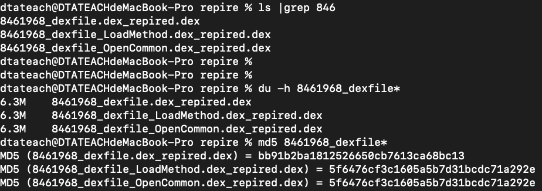

其实他们是在不同的脱壳时机dump下来的整体dex文件，前文也解释了有一些情况会dump下来畸形的dex。所以提供更多的时机，可以有更高的容错，which means：总有一个是对的。

#### 重组dex之在手机上使用FartFix

热心网友将上述修复工具做成了一个App，叫做FartFix，可以在手机上直接进行修复，不用拖到电脑上修复，免去电脑上安装Java环境之苦。界面如下：

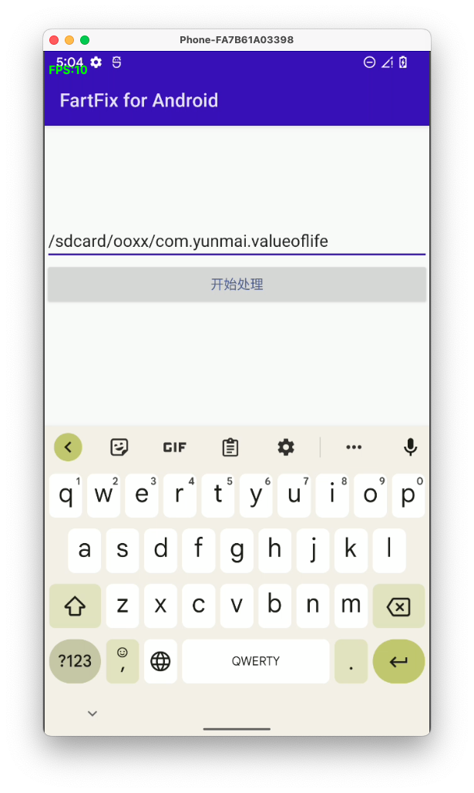

上述主动调用dump函数体的过程结束之后，点击App打开，按要求赋予文件夹读写管理权限，输入要修复的dex所在的路径后，点击开始处理。

```
% adb shell input text /sdcard/ooxx/com.yunmai.valueoflife
```

该App制作的比较简陋，全程没有任何提示，包括logcat里也没有。稍微多等一会儿，可以发现在`/sdcard/ooxx/repire`目录下，已经生成了修复完成的dex，如图所示。

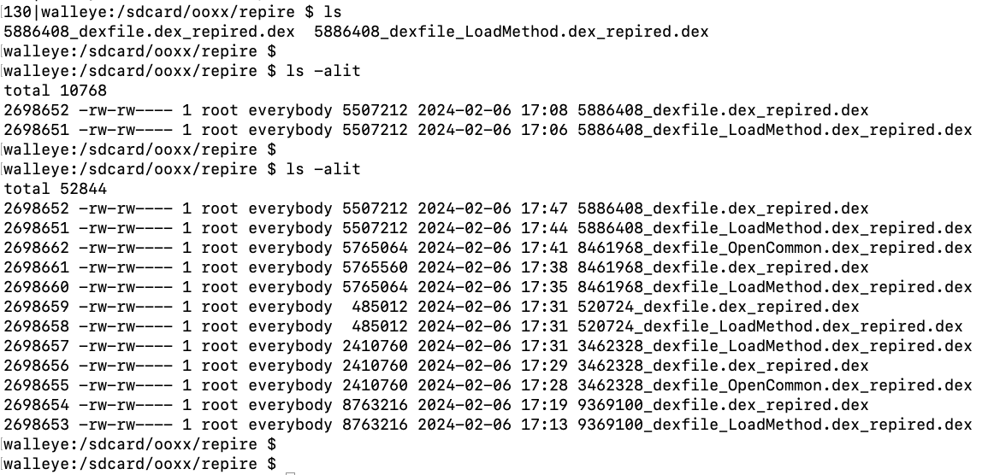

接下来即可拖到电脑上进行分析。

### 壳的检测机制的绕过

上文说到壳有一些方法来检测与对抗Fart12的主动调用，相应的我们也有一些方法，来绕过这些检测。主要有两种方法：

1. 缩小范围。比如只向`whitelist.txt`里写入几个、几十个、几百个类名，只脱自己想看的那些类。壳绝无可能阻止业务代码的加载，否则App本身就会崩溃。或者只处理一个dex里面的所有类：

```
$ cp 8461968_classlist.txt whitelist.txt
```

2. 跳过检测类。`logcat`的日志里本身是可以看到崩溃发生时尝试加载的类名的，绕过那个类即可。可以从`whitelist.txt`中删掉那个类即可。清空其余全部文件，然后点击App重来一遍。
