# 第一题

> 题目

通过反编译程序获得 flag 

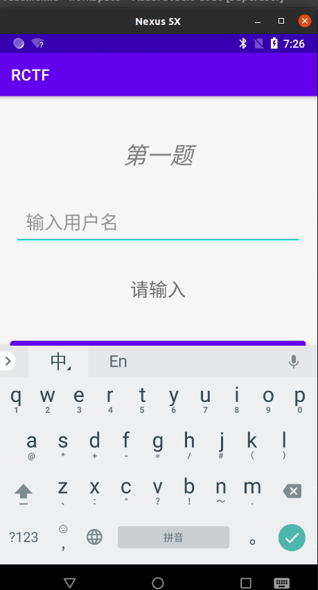

> 反编译程序，阅读业务逻辑代码

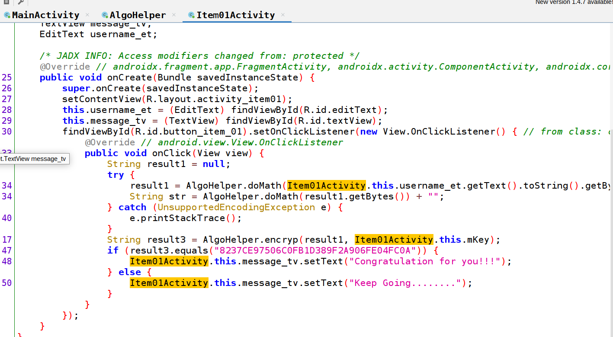

从1处可以知道，我们需要让加密后的结果等于`A952C70B9F21623B8B826F0355132163`

在此过程中，经过了两次加密，对输入的值 ;

加密的算法均在 AlgoHelper 中，并且得知它们均属于 native 函数： 

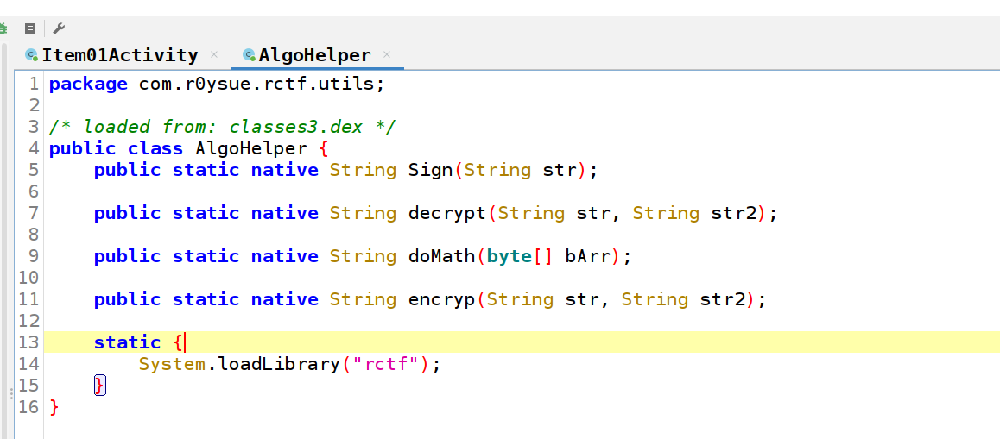

于是我们寻找到这个so，并使用 IDA 打开， so 有 32bit 和 64 bit ，这里分析 32bit 的so;

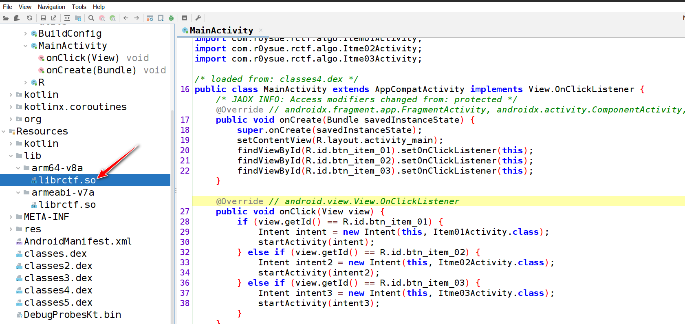

首先对静态注册函数进行搜索，无果：

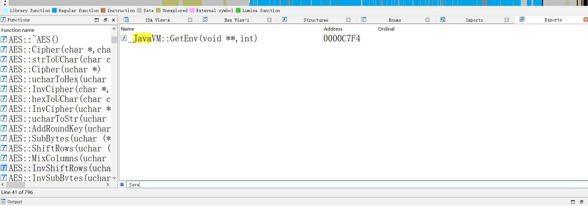

继续看动态注册，一般而言，动态注册会放置于 JNI_OnLoad 中 ：

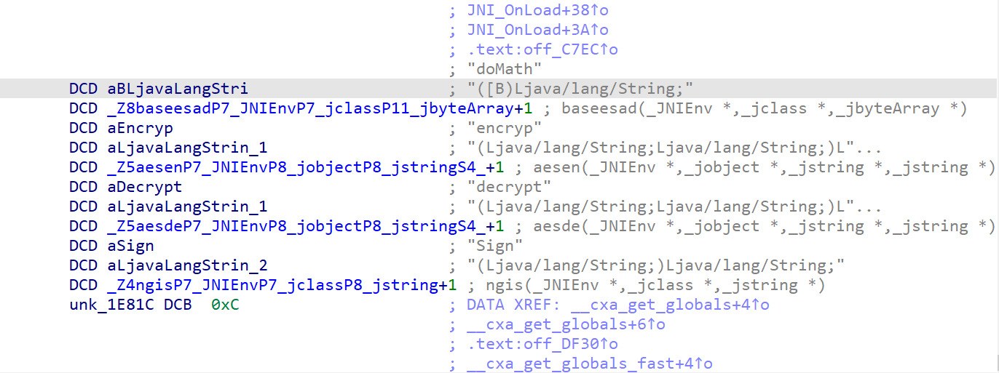

首先分析 doMath 函数：

这个函数很简单，反射调用了 Java 的 Base64 

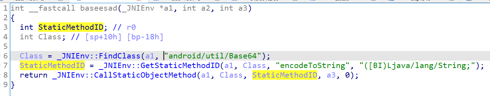

分析 encryp 函数：

根据符号名称可以得知，应该是使用了 AES，但是它是不是标准算法，我们需要测试一下：

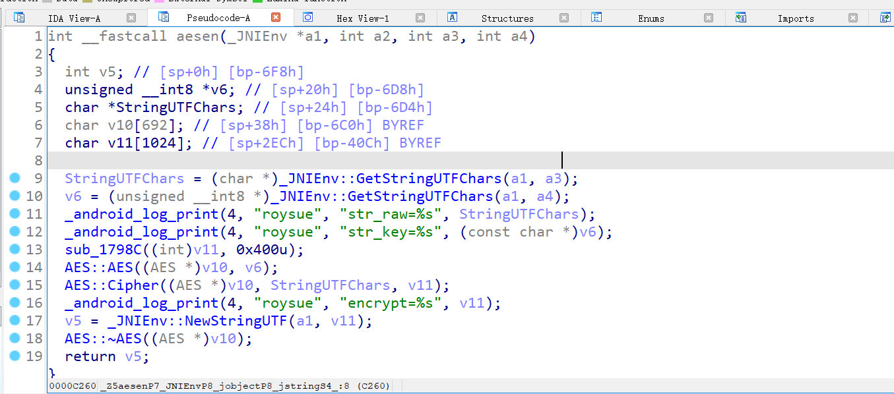

测试也非常简单，我们可以使用 unidbg 或者 frida 来进行测试;

首先需要找一份标准的算法来测试，直接用 cyberchef 即可：

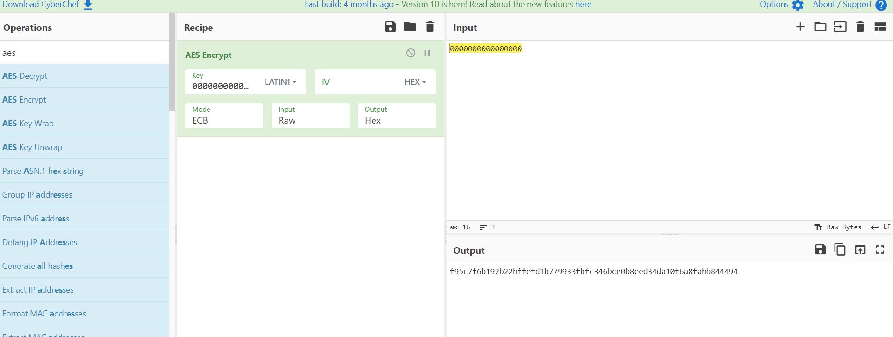

然后主动调用,结果是一致的，只看前32bit就可以，后面的的是填充出来的一组不用看

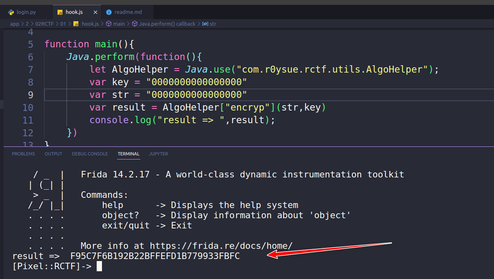

经过验证，说明这是一个标准的 AES 算法 ，那么剩下的就好做了 ，直接放在 cyberchef 中解密就可以

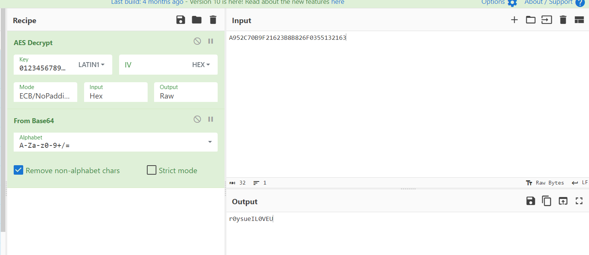

