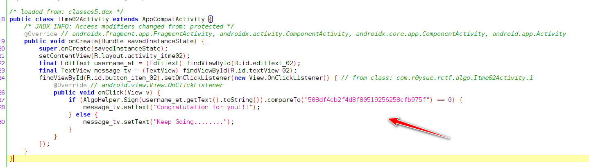
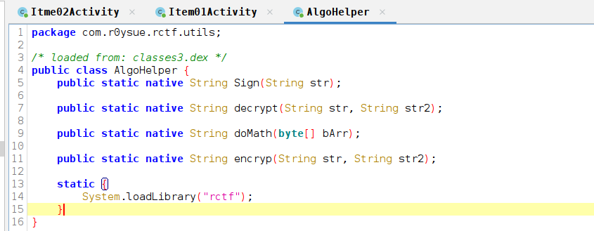
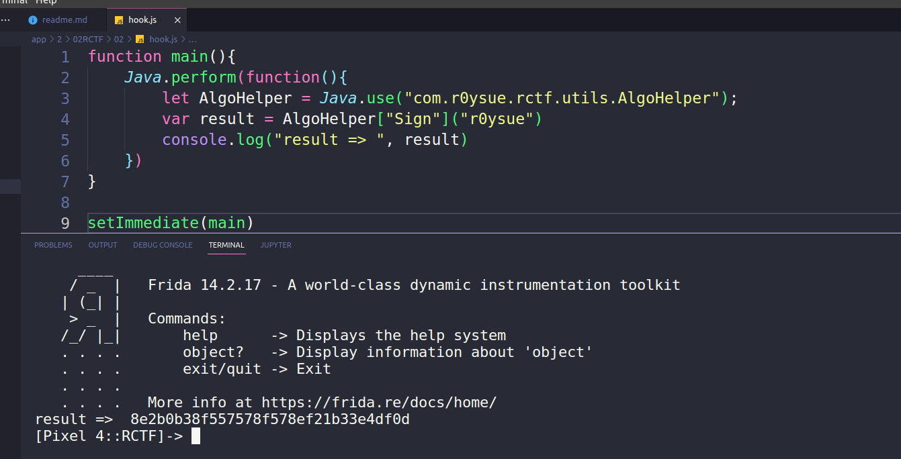
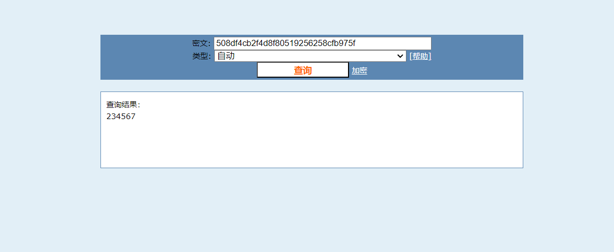
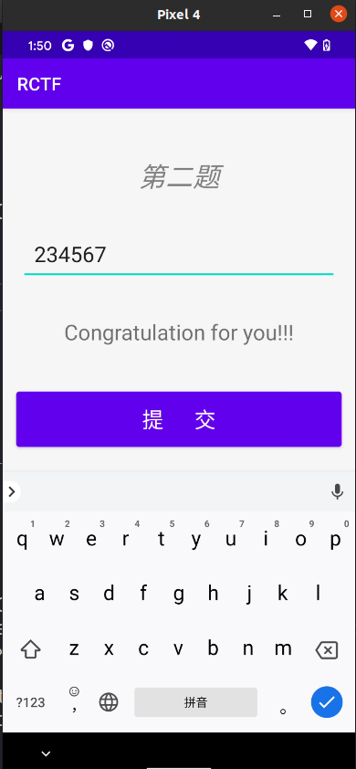
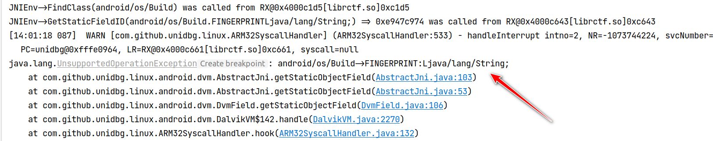
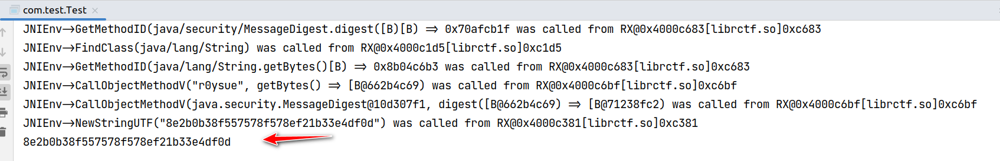

# 第二题

文件： ./02RCTF/file/rctf-debug.apk

## 题目要求

> 题目要求：输入6位数字，得到 Congratulation for you!!!

## 解题

点击按钮进入第二题目，题目要求输入6位数字，打开 Jadx 观看反编译后的核心业务逻辑代码：



使用 Sign 函数计算输入的内容，Sign 函数是一个 native 函数：



打开目标so，我们来看这个函数的具体实现：

```c
int __fastcall ngis(_JNIEnv *a1, int a2, int a3)
{
  const char *v3; // r0
  int i; // [sp+8h] [bp-80h]
  int ByteArrayElements; // [sp+Ch] [bp-7Ch]
  int v7; // [sp+10h] [bp-78h]
  int v8; // [sp+18h] [bp-70h]
  int v9; // [sp+1Ch] [bp-6Ch]
  int MethodID; // [sp+20h] [bp-68h]
  int v11; // [sp+24h] [bp-64h]
  int v12; // [sp+28h] [bp-60h]
  int StaticMethodID; // [sp+2Ch] [bp-5Ch]
  int v14; // [sp+30h] [bp-58h]
  int StaticFieldID; // [sp+34h] [bp-54h]
  int Class; // [sp+38h] [bp-50h]
  int StringUTFChars; // [sp+54h] [bp-34h]
  char v20[8]; // [sp+58h] [bp-30h] BYREF
  __int64 v21; // [sp+60h] [bp-28h]
  __int64 v22; // [sp+68h] [bp-20h]
  __int64 v23; // [sp+70h] [bp-18h]

  StringUTFChars = _JNIEnv::GetStringUTFChars(a1, a3);
  v3 = (const char *)_strcat_chk(StringUTFChars, "Mask", -1);
  _android_log_print(4, "roysue", "strcat => %s", v3);
  Class = _JNIEnv::FindClass(a1, "android/os/Build");
  StaticFieldID = _JNIEnv::GetStaticFieldID(a1, Class, "FINGERPRINT", "Ljava/lang/String;");
  _JNIEnv::GetStaticObjectField(a1, Class, StaticFieldID);
  v14 = _JNIEnv::FindClass(a1, "java/security/MessageDigest");
  StaticMethodID = _JNIEnv::GetStaticMethodID(
                     a1,
                     v14,
                     "getInstance",
                     "(Ljava/lang/String;)Ljava/security/MessageDigest;");
  v12 = _JNIEnv::NewStringUTF(a1, "MD5");
  v11 = _JNIEnv::CallStaticObjectMethod(a1, v14, StaticMethodID, v12);
  MethodID = _JNIEnv::GetMethodID(a1, v14, "digest", "([B)[B");
  v9 = _JNIEnv::FindClass(a1, "java/lang/String");
  v8 = _JNIEnv::GetMethodID(a1, v9, "getBytes", "()[B");
  _JNIEnv::CallObjectMethod(a1, a3, v8);
  v7 = _JNIEnv::CallObjectMethod(a1, v11, MethodID);
  ByteArrayElements = _JNIEnv::GetByteArrayElements(a1, v7, 0);
  *(_QWORD *)v20 = 0LL;
  v21 = 0LL;
  v22 = 0LL;
  v23 = 0LL;
  for ( i = 0; i <= 15; ++i )
    sub_C708(&v20[2 * i], -1, "%02x", *(unsigned __int8 *)(ByteArrayElements + i));
  return _JNIEnv::NewStringUTF(a1, v20);
}
```

大概浏览代码，我们知道使用了 NDK 反射 Java 层的 MD5 ，但是具体有没有改内容，我们没有更多的时间去看，直接动态验证一下：



然后再到 cyberchef 中验证：


可以看到，结果是一致的，那么既然是标准算法，而且输入是简单的数字，我们可以到彩虹表中碰碰运气：



然后将结果输入文本框内，得到 Congratulation for you!!! 结果：



当然我们也可以用 frida 主动调用这个函数暴力拿值。

也可以使用 unidbg 来做，毕竟手机的性能是有点差的。

首先就是框架的搭建：

```java
package com.test;

import com.github.unidbg.AndroidEmulator;
import com.github.unidbg.Emulator;
import com.github.unidbg.LibraryResolver;
import com.github.unidbg.Module;
import com.github.unidbg.arm.backend.DynarmicFactory;
import com.github.unidbg.arm.backend.Unicorn2Factory;
import com.github.unidbg.arm.context.Arm32RegisterContext;
import com.github.unidbg.arm.context.RegisterContext;
import com.github.unidbg.hook.hookzz.HookEntryInfo;
import com.github.unidbg.hook.hookzz.HookZz;
import com.github.unidbg.hook.hookzz.IHookZz;
import com.github.unidbg.hook.hookzz.WrapCallback;
import com.github.unidbg.linux.android.AndroidEmulatorBuilder;
import com.github.unidbg.linux.android.AndroidResolver;
import com.github.unidbg.linux.android.dvm.*;
import com.github.unidbg.memory.Memory;
import com.github.unidbg.utils.Inspector;
import com.sun.jna.Pointer;

import java.io.File;

public class Test extends AbstractJni {
    private final AndroidEmulator emulator;
    private final VM vm;
    private final Module module;

    public static void main(String[] args) {
        Test test = new Test();
        test.call_func();
    }
    public Test(){
        emulator = AndroidEmulatorBuilder
                .for32Bit()
                .addBackendFactory(new Unicorn2Factory(true))
                .build();
        Memory memory = emulator.getMemory();
        LibraryResolver resolver = new AndroidResolver(23);
        memory.setLibraryResolver(resolver);
        vm = emulator.createDalvikVM(new File("unidbg-android/src/test/java/com/test/rctf-debug.apk"));
        vm.setJni(this);
        vm.setVerbose(true);
        DalvikModule dm = vm.loadLibrary("rctf", true);
        dm.callJNI_OnLoad(emulator);
        module = dm.getModule();
    }

    public void call_func(){
        DvmClass klass = vm.resolveClass("com.r0ysue.rctf.utils.AlgoHelper");
        String result = klass.callStaticJniMethodObject(emulator,
                "Sign(Ljava/lang/String;)Ljava/lang/String;","r0ysue").getValue().toString();
        System.out.println(result);
    }
}

```

然后运行，发现报了一个环境的错误：



这里获取了指纹信息，需要补环境，但是根据前面frida的动态验证，其实并没有使用到任何其它信息，说明这里就在阻碍 unidbg 的运行：这里我们补环境，随意给些内容就好：

```java
@Override
public DvmObject<?> getStaticObjectField(BaseVM vm, DvmClass dvmClass, String signature) {
    switch (signature) {
        case "android/os/Build->FINGERPRINT:Ljava/lang/String;":{
            return new StringObject(vm,"akdjfkakjkdfk");
        }
    }
    return super.getStaticObjectField(vm, dvmClass, signature);
}
```

最后得到结果：



我们暴力遍历6位数字，获取最终的结果（如果对 Java 熟悉的可以开多线程去跑）

```java
package com.test;

import com.github.unidbg.AndroidEmulator;
import com.github.unidbg.Emulator;
import com.github.unidbg.LibraryResolver;
import com.github.unidbg.Module;
import com.github.unidbg.arm.backend.DynarmicFactory;
import com.github.unidbg.arm.backend.Unicorn2Factory;
import com.github.unidbg.arm.context.Arm32RegisterContext;
import com.github.unidbg.arm.context.RegisterContext;
import com.github.unidbg.hook.hookzz.HookEntryInfo;
import com.github.unidbg.hook.hookzz.HookZz;
import com.github.unidbg.hook.hookzz.IHookZz;
import com.github.unidbg.hook.hookzz.WrapCallback;
import com.github.unidbg.linux.android.AndroidEmulatorBuilder;
import com.github.unidbg.linux.android.AndroidResolver;
import com.github.unidbg.linux.android.dvm.*;
import com.github.unidbg.memory.Memory;
import com.github.unidbg.utils.Inspector;
import com.sun.jna.Pointer;

import java.io.File;

public class Test extends AbstractJni {
    private final AndroidEmulator emulator;
    private final VM vm;
    private final Module module;

    public static void main(String[] args) {
        Test test = new Test();
        test.patch_log();
        // test.call_func();
        String targetHash = "508df4cb2f4d8f80519256258cfb975f";
        String input = "";
        for (int i = 100000; i <= 999999; i++) {
            input = String.format("%06d", i); // 格化为6位数字字符串
            System.out.println(input);
            String res = test.call_func(input);
            if (res.equals(targetHash)) {
                System.out.println("Match found! Input: " + input);
                break;
            }
        }
    }

    public void patch_log(){
        emulator.getMemory().pointer(module.base + 0xC4BE).setInt(0,0xbf00bf00);
    }


    public Test(){
        emulator = AndroidEmulatorBuilder
                .for32Bit()
                .addBackendFactory(new Unicorn2Factory(true))
                .build();
        Memory memory = emulator.getMemory();
        LibraryResolver resolver = new AndroidResolver(23);
        memory.setLibraryResolver(resolver);
        vm = emulator.createDalvikVM(new File("unidbg-android/src/test/java/com/test/rctf-debug.apk"));
        vm.setJni(this);
        vm.setVerbose(false);
        DalvikModule dm = vm.loadLibrary("rctf", true);
        dm.callJNI_OnLoad(emulator);
        module = dm.getModule();
    }

    public String call_func(String str){
        DvmClass klass = vm.resolveClass("com.r0ysue.rctf.utils.AlgoHelper");
        String result = klass.callStaticJniMethodObject(emulator,
                "Sign(Ljava/lang/String;)Ljava/lang/String;",str).getValue().toString();
        return result;
    }

    @Override
    public DvmObject<?> getStaticObjectField(BaseVM vm, DvmClass dvmClass, String signature) {
        switch (signature) {
            case "android/os/Build->FINGERPRINT:Ljava/lang/String;":{
                return new StringObject(vm,"akdjfkakjkdfk");
            }
        }
        return super.getStaticObjectField(vm, dvmClass, signature);
    }
}

```

最终的结果就是 234567 


