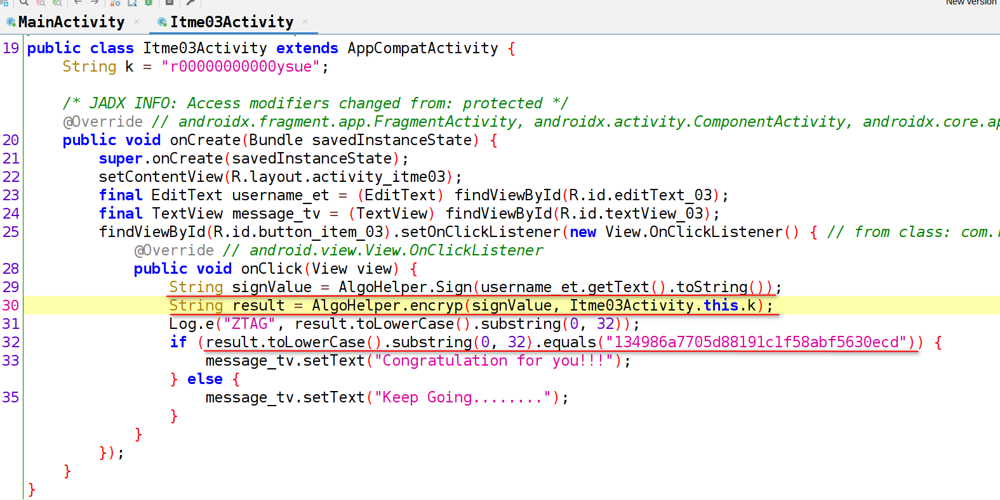
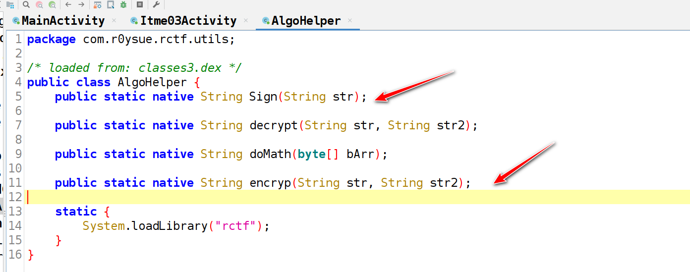
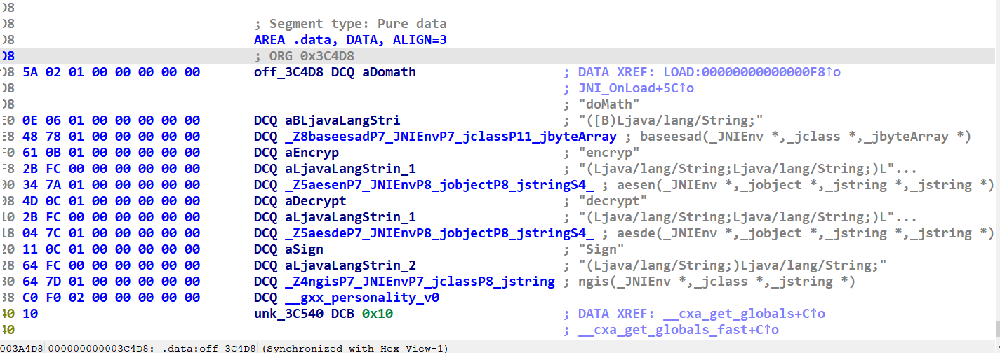
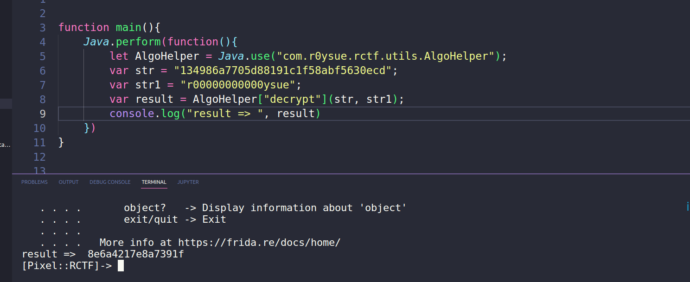
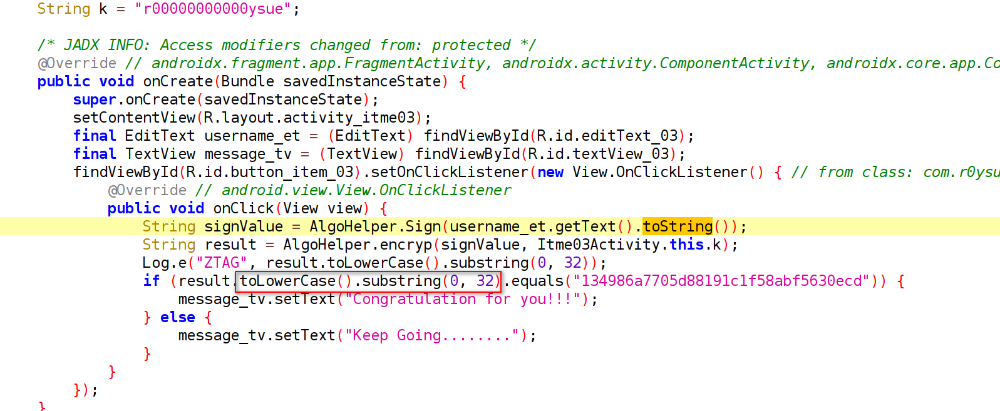
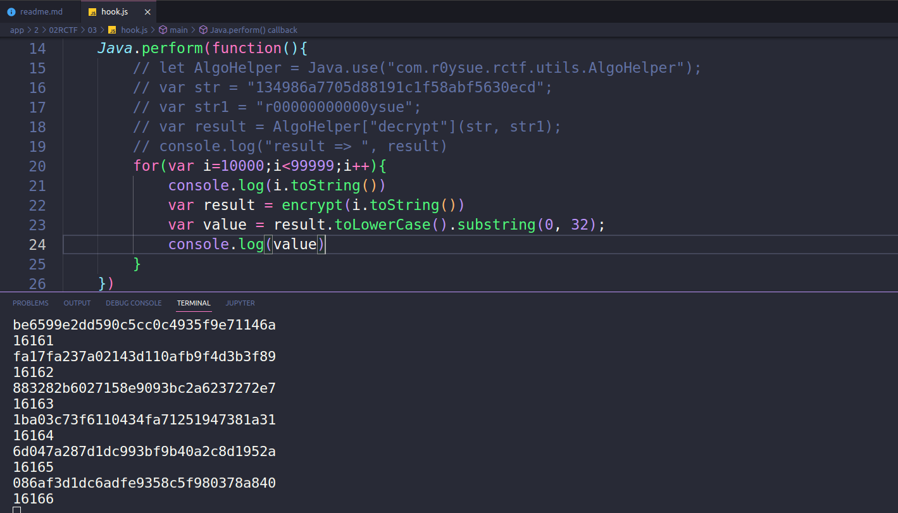

# 第三题

文件： ./02RCTF/file/rctf-debug.apk

> 输入5位数字，得到 得到 Congratulation for you!!!

## 反编译 apk 并分析

反编译 apk 后，找到第三题的业务代码：



根据业务代码，我们梳理一下具体的计算流程：

1. 获取文本框中的值
2. 通过 Sign 函数加密
3. 再放入到 encrypt 函数中加密，同时有一个值传了进去 ： r00000000000ysue
4. 得到的结果等于 134986a7705d88191c1f58abf5630ecd

让我们看看 Sign 和 encrypt 函数是什么加密：



可以看到，它们是native函数，需要到 native 层去看具体的代码;将 apk 解压缩，并将 so 拖入 IDA 中分析; 

注： 分析64位的so;



这几个函数其实我们前面已经分析过了，这里就不着重分析了，同时，我们把关注点移到 decrypt 上 ;

一般而言，加密函数和解密函数是伴随出现的，主动调用下这里：



输出的结果是 16 位， 这里就比较诡异了， md5的值应该是 32 位。看来这个解密函数靠不住。

还是走正常的暴力破解途径：

这里需要注意一个点，不然就会出错：



得到的结果需要取低 32 位，一定要注意这个细节; 我们用 frida 来暴力遍历：



脚本：

```js


function Sign(str){
    let AlgoHelper = Java.use("com.r0ysue.rctf.utils.AlgoHelper");
    return AlgoHelper["Sign"](str)
}

function encrypt(str){
    let AlgoHelper = Java.use("com.r0ysue.rctf.utils.AlgoHelper");
    return AlgoHelper["encryp"](Sign(str), "r00000000000ysue")
}

function main(){
    Java.perform(function(){
        // let AlgoHelper = Java.use("com.r0ysue.rctf.utils.AlgoHelper");
        // var str = "134986a7705d88191c1f58abf5630ecd";
        // var str1 = "r00000000000ysue";
        // var result = AlgoHelper["decrypt"](str, str1);
        // console.log("result => ", result)
        for(var i=10000;i<99999;i++){
            var result = encrypt(i.toString())
            var value = result.toLowerCase().substring(0, 32);
            if(value === "134986a7705d88191c1f58abf5630ecd"){
                console.log(i.toString())
                break
            }
        }
    })
}


setImmediate(main)
```

最终的结果就是 22578


