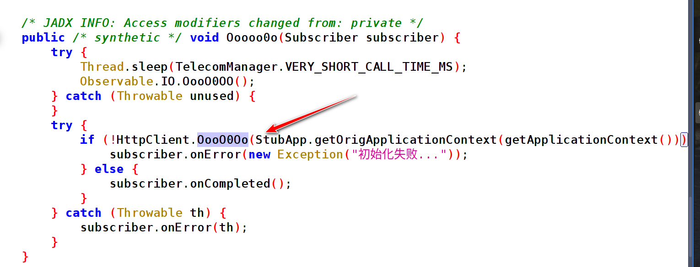
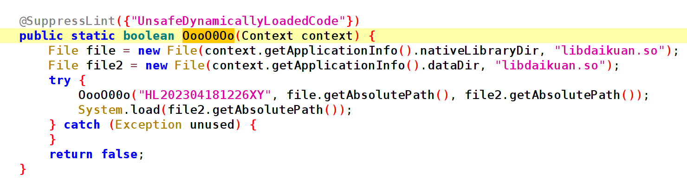
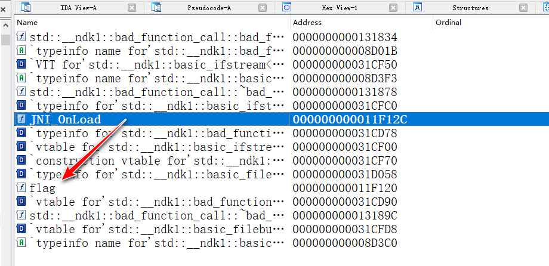
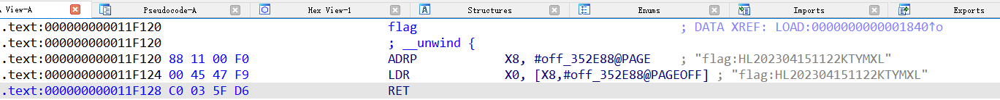
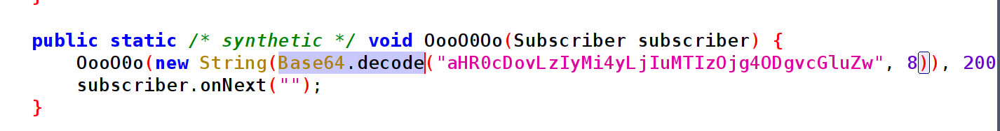

# 天天小额贷

1. 该程序代码中，手机号登录界面所对应类名（答案格式：com.tencent.mm.xxx.xxx）
答> cn.forensix.daikuan.ui.login.LoginActivity

2.  解密libdaikuan.so使用的加密算法 
答> AES-CBC-Pkcs5padding

3. 解密libdaikuan.so使用的加密密钥？
答> HL202304181226XY

4. 程序登录时，提交请求是调用的JNI函数，请问该JNI函数对应的Java层函数名是什么？
答>doPost

5. 程序登录时，请求的IP地址？

6. 程序中潜藏的flag？（答案格式:flag:AABB123456）
答>flag:HL202304151122KTYMXL

过程文档：

1. 首先对 APK 文件解包 ，提取 libdaikuan.so 文件， 用 64 bit 的 IDA 打开 ，发现打不开，这个 so 是加密状态。

2. so 一般会在启动的时候进行加载，我们找到应用启动的时候第一个要加载的类，即 SplashActivity , 在里面发现了 so 加载的逻辑，如图 2-1 所示：

图 2-1 

3. 继续追踪，看他了它处理 so 的逻辑 ：

图 2-2

4. 再往下走可以看到加密算法，使用的是 AES/CBC/PKCS5Padding ，这时候也可以确认密钥 ：HL202304181226XY，大家感兴趣可以还原一下算法，它把so解密以后放在了 /data/data/packagename 目录下，我们直接提取出来用 IDA 打开即可；当然也可以用 frida 把 so dump 再修复

5. 打开后可以正常看到导出表，如图 2-3 所示：

图 2-3

除此之外，我们还看到了 flag ，双击进去看它的内容，如图 2-4 所示：

图 2-4

6. ip 地址 ，如图 2-5 所示，自己用 bae64 解密一下就好

图 2-5

