# 六层锁机

案例的资源位于 apk/01/six.apk 

## 1. 登录绕过

在登录页面，我们需要输入 username 和 password ，根据 jadx 反编译的结果可知 ， a 函数对 username 进行了加密，如图 1-1 所示：

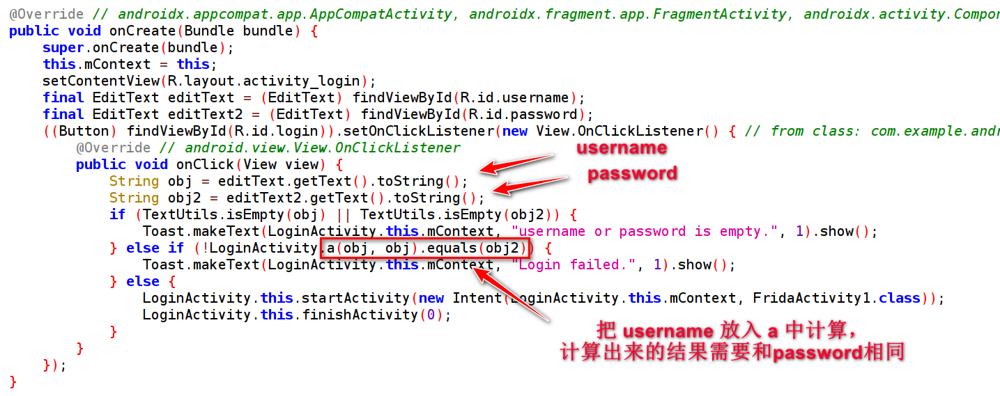
图 1-1 

a 函数的内容如图 1-2 所示：

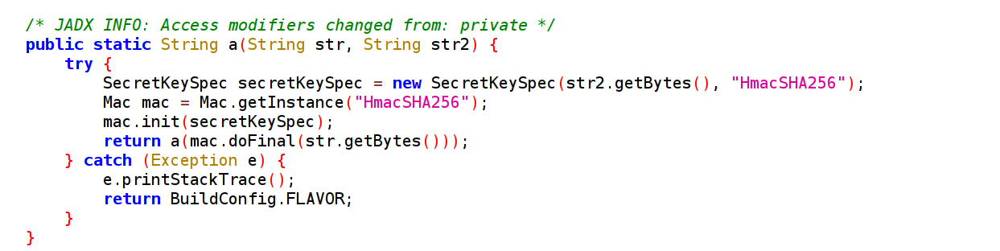
图 1-2

所以要绕过登录验证，只需要 Hook a 函数得到它的返回值输入 password 中即可 ， username 是随便输入的。

Hook code 如下所图 1-3 所示：

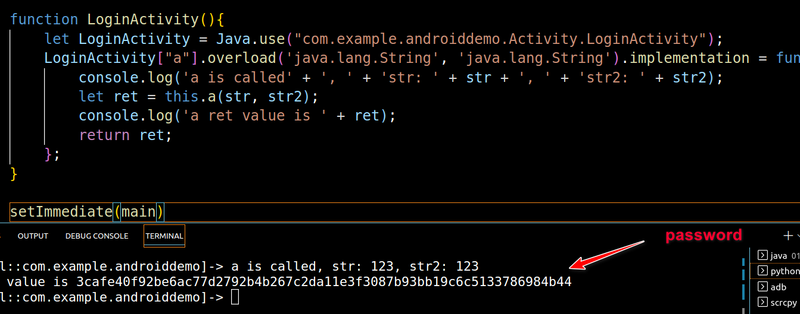
图 1-3


## 2. 第一层锁机绕过

第一层锁机的页面如图 1-4 所示：

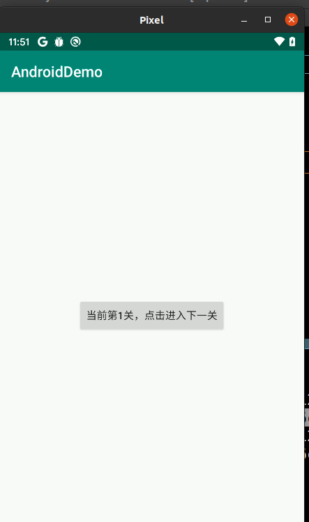
图 1-4

反编译后的结果如图 1-5 所示：

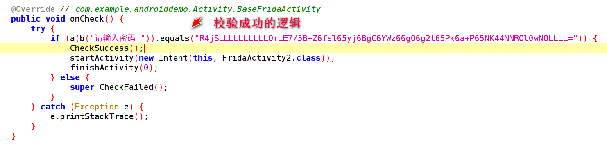
图 1-5

我们只要 Hook a 函数 ，让它返回 “R4jSLLLLLLLLLLOrLE7/5B+Z6fsl65yj6BgC6YWz66gO6g2t65Pk6a+P65NK44NNROl0wNOLLLL=”即可，根本不需要追究具体的算法细节。


## 第二层锁机绕过

我们直接看第二层锁机的反编译结果，如图 1-6 所示：

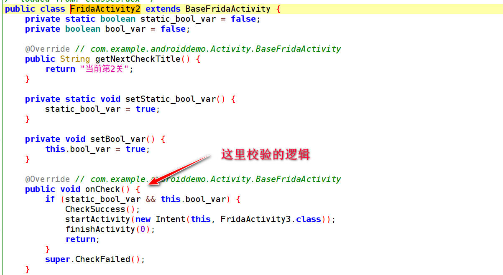
图 1-6

我们只需要让 if 语句中的两个变量都变为 true 即可 ，同时在这个类中，看到了它有预留设置的接口，我们直接使用 frida 操作即可，代码如下 ：

```js
function Activity2(){
    let FridaActivity2 = Java.use("com.example.androiddemo.Activity.FridaActivity2");
    // 通过接口设置
    // FridaActivity2.setStatic_bool_var()
    // 直接设置
    FridaActivity2.static_bool_var.value = true 
    Java.choose("com.example.androiddemo.Activity.FridaActivity2",{
        onMatch:function(ins){
            // 通过接口设置
            // ins.setBool_var()
            // 直接设置
            ins.bool_var.value = true
        },onComplete:function(){

        }
    })
}
```

## 第三层锁机绕过

第三层锁机在第二层的基础上做了一些改进，如图 1-7 所示：

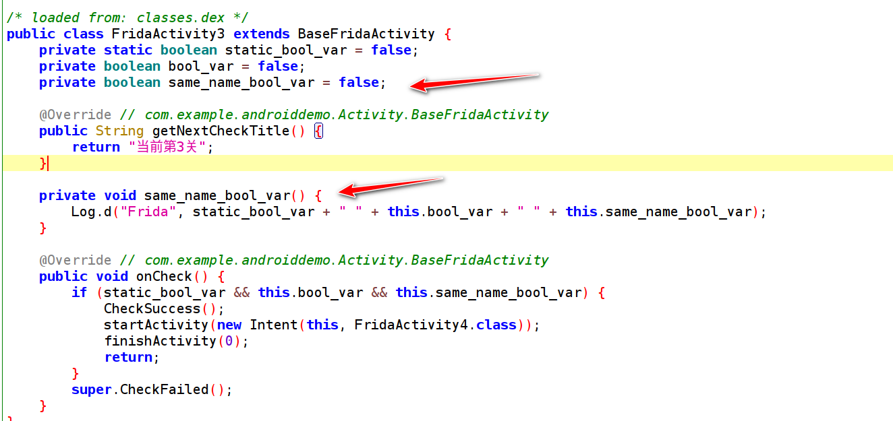
图 1-7

变量名和函数名相同，如果我们使用上一题中的方式进行直接设置值，frida 会报错：


```js
let FridaActivity3 = Java.use("com.example.androiddemo.Activity.FridaActivity3");
// 这样操作会报错
FridaActivity3.same_name_bool_var.value = true
```

而正确的做法是这样的，需要在重名的变量前加一个 下划线 => "_"

```js
FridaActivity3._same_name_bool_var.value = true
```

## 第四层锁机绕过

第四层锁机的校验代码如图1-8所示

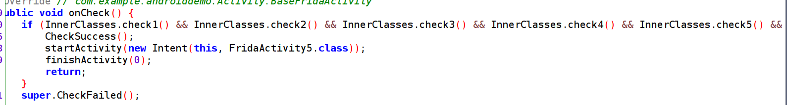
图 1-8

其中检验的逻辑是内部类中的多个函数，如图 1-9 所示：

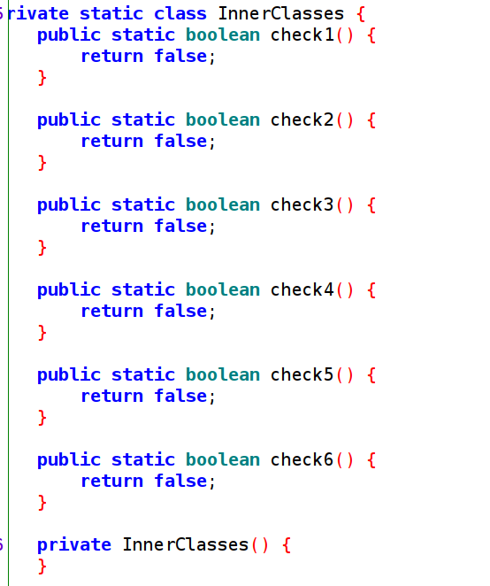
图 1-9

这里提供两种解决方案：

- 第一种：依次进行 Hook ，比较简单，这里就不贴代码了

- 第二种：通过反射拿到内部类的所有方法，然后 Hook 返回 true，代码如下所示：

```js
function Activity4(){
    var class_name = "com.example.androiddemo.Activity.FridaActivity4$InnerClasses";
    var all_methods = Java.use(class_name).class.getDeclaredMethods();
    console.log("all_methods => ", all_methods);
    for (var i = 0; i < all_methods.length; i++) {
        var method = all_methods[i];
        console.log("single method => ", method);
        var substring = method.toString().substr(method.toString().indexOf(class_name) + class_name.length + 1);
        var finalMethodString = substring.substr(0, substring.indexOf("("));
        console.log("finalMethodString => ", finalMethodString);
        Java.use(class_name)[finalMethodString].implementation = function () { return true };
    }
}
```


## 第五层锁机绕过

第五层的校验逻辑如图 1-10 所示：


图 1-10

继续追入 getDynamicDexCheck 函数中，如图 1-11 所示：

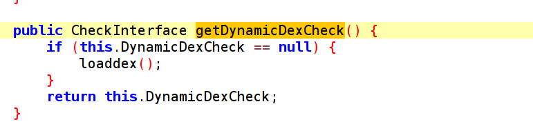
图 1-11

继续追入 loadDex 函数中，如图 1-12 所示 。 这里动态加载了一个 dex 。绕过的核心逻辑是 hook 动态加载的 dex 返回 true 即可。

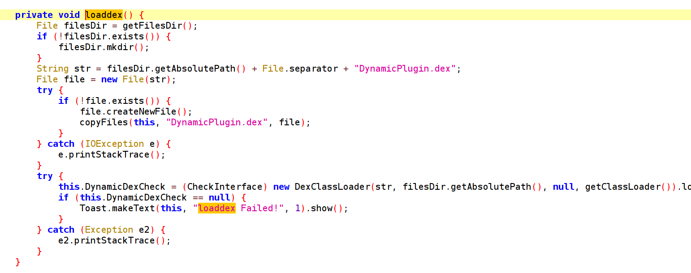
图 1-12

动态加载 Dex 是用 DexClassLoader 加载的，和 APP 当前使用的 ClassLoader 不一样，所以我们要 切换 ClassLoader 来进行 Hook 。

代码如下所示：

```js
function Activity5(){
    // var methods = Java.enumerateMethods("*!check")
    // console.log(JSON.stringify(methods,null,2))
    Java.enumerateClassLoaders({
        onMatch: function (loader) {
            try {
                if (loader.findClass("com.example.androiddemo.Dynamic.DynamicCheck")) {
    
                    Java.classFactory.loader = loader;
    
                }
            }
            catch (error) {
                console.log(" continuing :" + error)
            }
        },
        onComplete: function () {
            console.log("EnumerateClassloader END")
        }
    })
    Java.use("com.example.androiddemo.Dynamic.DynamicCheck").check.implementation = function(){
        return true;
    }
}
```

## 第六层锁机绕过

第六层锁机非常简单，如图 1-13 所示，只要 Hook 图中的三个类里面的 check 函数返回 true 即可。

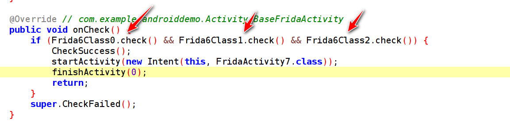
图 1-13


# 注册机登录绕过

案例的资源位于 apk/02/registerLogin.apk 

题目要求：

**_【题干】 该APP程序使用了机器码验证，想办法绕过机器码验证，以便正常使用该APP功能。绕过后，随意输入账号密码，将获得flag。_**


- 安装并打开 APP 后 ，直接定位到登录按钮的点击事件中，如图 1-14 中，核心的处理位于 MyWaitTimerTask 中

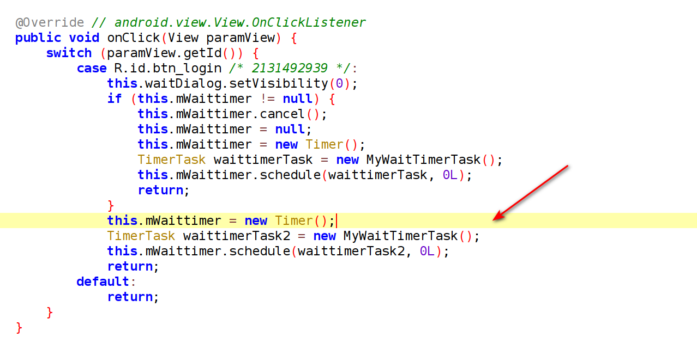
图 1-14

在这里 CheckUrl 会校验 url ，很可疑，我们追一下这个函数

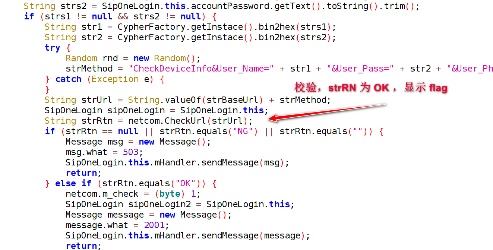
图 1-15

CheckUrl 函数的校验逻辑：如果正常返回 “OK”，否则返回 “NG” ，这和上一张图片中的检测逻辑也契合

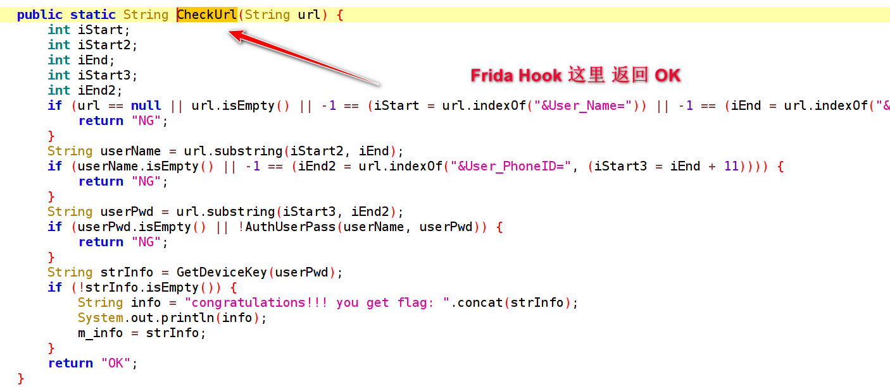
图 1-16

hook 这个函数返回 “OK”

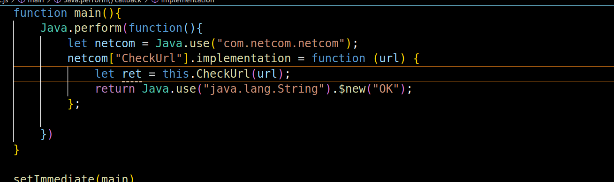
图 1-17

最终的结果如图 1-18 所示：flag 正确的显示到了屏幕上，不论我们输入什么内容。


图 1-18


