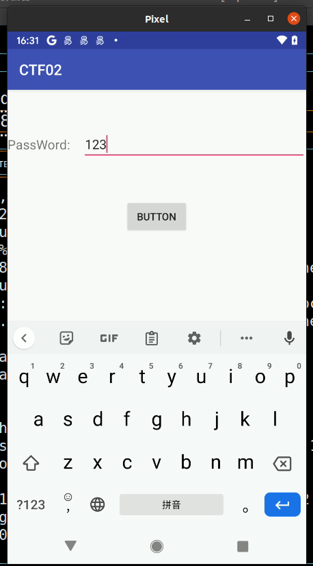
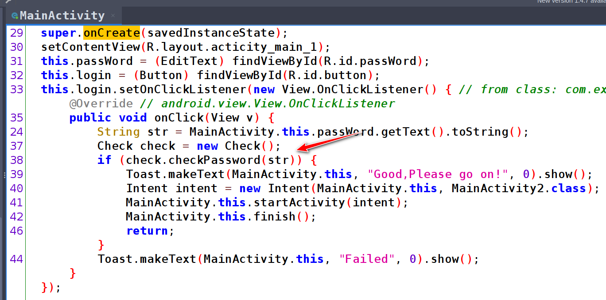
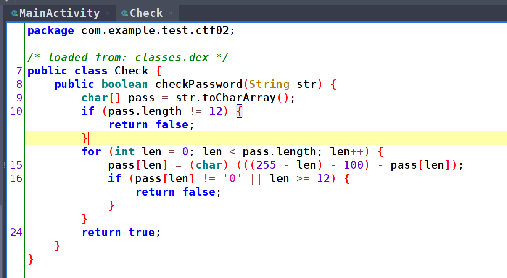
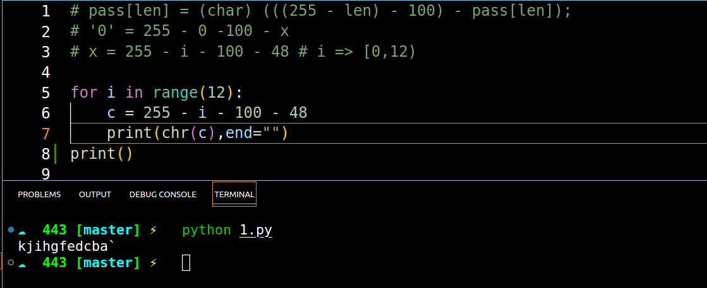
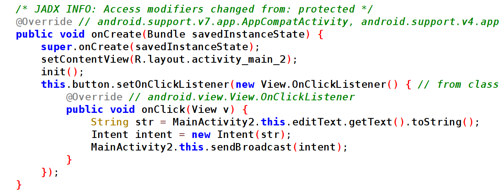
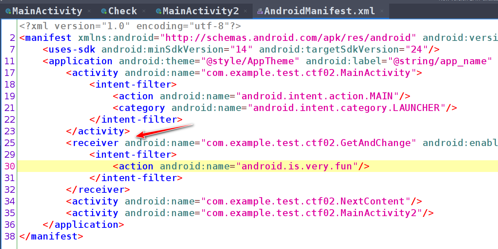
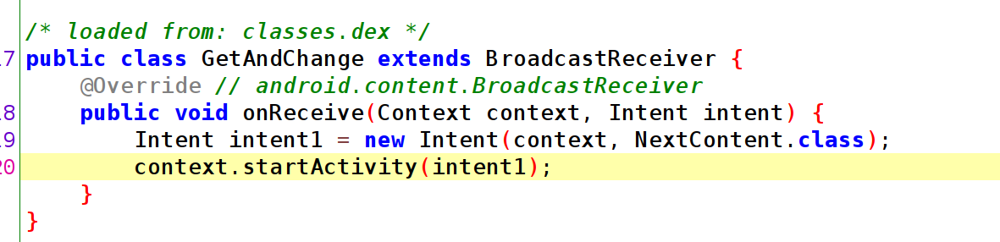
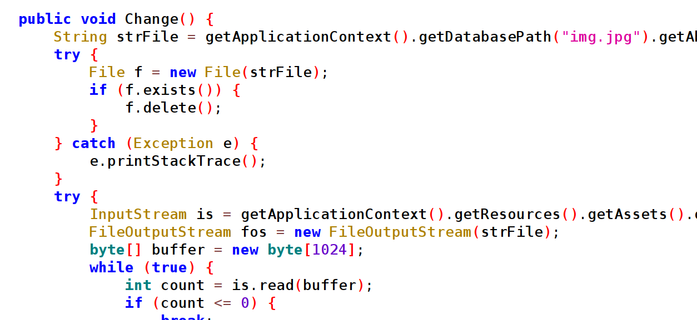
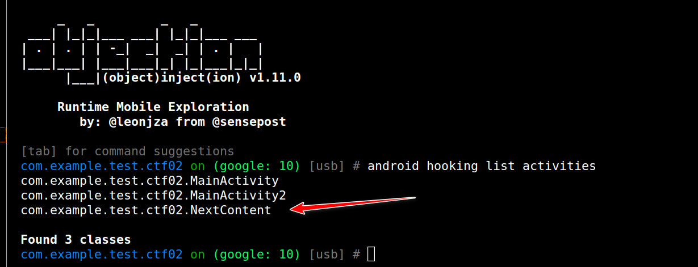
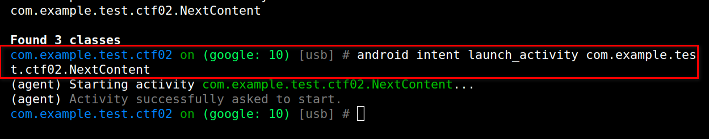

# 攻防世界-新手-Android基础

打开 APP 后界面如图　３－１　所示：

图 3-1

直接使用 Jadx-gui 打开 APP ， 找到按钮点击的逻辑，如图 3-2 所示：

图 3-2

校验的具体逻辑如图 3-3 所示：

图 3-3 

我们这里使用 python 来进行倒推，如图 3-4 所示：

图 3-4

然后把密码输入密码框内，进入下一个界面，如图 3-5 所示：

图 3-5

正常的逻辑需要再逆向这里的显示码，我们看下这边的处理逻辑，如图 3-6 所示：

图 3-6

当点击按钮之后就会发送一个广播，我们去看看接受的地方，如图 3-7 所示：

图 3-7

打开接受广播的这个类，如图 3-8 所示：

图 3-8

可以发现它什么都没有做，只是单纯的调用 NextConent 类 , 然后点击按钮，发现没有任何效果 。NextConent Activity 中的内容如图 3-9 所示：

图 3-9

它其实就是在这里打开了一张图片，我们直接用 objection 拉起这个 Activity 看看什么效果，操作如图 3-10，3-11 所示：

图 3-10

图 3-11

最终拉起来的效果如图 3-12 所示：

图 3-12

